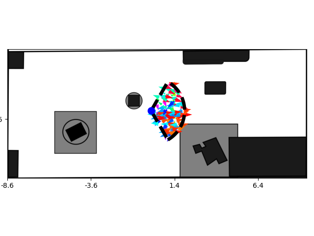

# Exploration


## Task

Input: map

Output: a exploration plan (view_point1, view_point2, .... ). It consist of a list of view points. 

For each view point, a region that robot can observe also be provided.
There can be two versions of robot obseving region:

 - cone: 
   - parametes:
     - robot_facing_angle = 0 # in radians
     - fov_angle = np.radians(120)
     - fov_radius = 200 # unit is pixel here

  


 - rectangle:
   - parametes:
     - obs_x = 1
     - obs_y = 1
     - delta_x = 6
     - delta_y = 3

  
  
## Implementation
Now the unit is pixel, and can be visualized directly in the figure.

In explore.py, the class `class ExploreMap` is created. The util functions can be put in `explore_utils.py`. And config parameters can be put in `explore_config.yaml`, and read by `self.config_params['map_file']` for example.


The task function to be implemented is:
```python
    def get_view_point_list():
        ## return a list of view points
        pass
```

In the class, some help functions are:

### visulize the observing area
```python
explore = ExploreMap('explore_config.yaml')

## check map and plot the visual area
vis_area = {
    "vis_type": "cone",  # "cone" or "rectangle"
    "robot_facing_angle": 0,  # robot facing direction (radians), 0 means facing right along the x-axis
    "fov_angle": np.radians(120),  # Field of view angle in radians
    "fov_radius": 200,  # Field of view radius
}
# explore.plot_map(vis_area=vis_area, robot_position=[1000, 1200])

```

  


### check if one location is in free space
Based on the map, if the color is white, then it is in free space.
```python
explore = ExploreMap('explore_config.yaml')

## Check if a position is in free space, can uncomment plot line in get_if_in_free_space to visualize the position
# explored_position = [1500, 1200]
explored_position = [400, 1050]
explore.get_if_in_free_space(explored_position)

```

```bash
The explored_position [400, 1050] is in free space.
```
  


